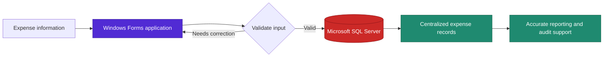

<div align="center">

# Pinnacle Industrial Controls Ltd. Expenditure Manager

**A C# and Microsoft SQL expense-tracking application for accurate, auditable financial records.**


</div>

> **Project focus:** replace error-prone manual expense entry with a validated, database-backed desktop workflow.

| Navigate | Navigate | Navigate |
| :--- | :--- | :--- |
| [Impact](#impact) | [Architecture](#application-workflow) | [Setup](#getting-started) |

---

A desktop expense-tracking application built to improve the accuracy, organization, and auditability of financial records at Pinnacle Industrial Controls Ltd.

- Eliminated manual-entry errors through structured data capture and validation.
- Reduced audit discrepancies by **30%**.
- Improved the organization and accuracy of expense-related financial records.
| Outcome | Result |
| --- | --- |
| Data quality | Eliminated manual-entry errors through structured capture and validation |
| Audit readiness | **30% reduction** in audit discrepancies |
| Record management | Centralized, organized financial records in Microsoft SQL Server |

## Application Workflow



<details>
<summary><strong>How the workflow improves record quality</strong></summary>

1. An employee enters expense information through the desktop application.
2. The application checks input before a record is saved.
3. Validated information is stored centrally in Microsoft SQL Server.
4. Consistent records improve traceability and reduce discrepancies during audit review.

</details>

## Key Features

- Expense data-entry interface built with C# Windows Forms.
- Microsoft SQL-backed storage for centralized expense records.
- Validation workflows to support accurate and consistent data capture.
- Database-driven record management for improved traceability and audit readiness.
- Application workflows designed around expense-management requirements.
| Feature | Value |
| --- | --- |
| C# Windows Forms interface | Provides a structured workflow for entering expense information |
| Microsoft SQL-backed storage | Centralizes expense records for reliable retrieval and management |
| Input validation | Supports accurate and consistent data capture |
| Database-driven records | Improves traceability and audit readiness |
| Requirements-based workflow | Aligns the application with expense-management needs |

| Development environment | Visual Studio 2022 |

## Project Workflow

1. Capture expense information through the desktop application.
2. Validate submitted data before it is recorded.
3. Store validated records in the Microsoft SQL database.
4. Retrieve and manage expense information through the application workflow.
5. Use consistent, database-backed records to support accurate reporting and audits.
## Getting Started

## Getting Started
<details>
<summary><strong>Prerequisites and local setup</strong></summary>


</details>

## Visual Preview

> Add screenshots here after uploading them to `docs/images/`. Good options are the expense-entry form, the database schema, and a successful record-management screen.

```text
docs/
└── images/
    ├── expense-entry-form.png
    ├── database-schema.png
    └── application-dashboard.png
```

Then embed an image in this section with:

```markdown

```

## Resume Summary
